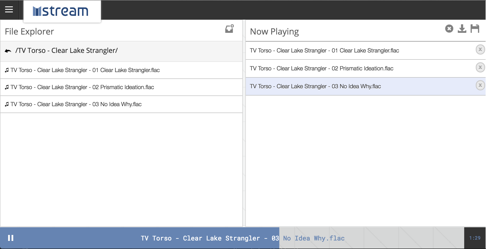

mStream is an music streaming server.   It's focus is on ease of installation.  mStream will work right out of the box without any configuration.

## Main Features
* Supports FLAC streaming
* Built in SQLite DB.  No need to setup MySQL
* Works on Mac, Linux and Windows
* [Integrates easily with Beets DB](https://github.com/beetbox/beets)


## Live Demo
Check it out: http://darncoyotes.mstream.io/


## Installation

### Default

Run the following commands:

```shell
npm install -g mstream

cd /path/to/your/music

mstream
```

Make sure it's working by checking out http://localhost:3000/


### Using Docker

Download the Dockerfile, or clone the repository, then run the following
commands:

```shell
docker build -t local/mstream .

docker run --rm -v /path/to/my/music:/music local/mstream
```

The ENTRYPOINT is `mstream`, so you can use the same option as if using the
default installation.

```shell
docker run --rm -v /path/to/my/music:/music local/mstream -l -u username -x password
```

## Options

```shell
-p, --port           -> set port number
-l, --login          -> enable user login
-u, --user           -> add user
-x, --password       -> set Password
-G, --guest          -> set guest username
-X, --guestpassword  -> set guest password
-d, --database       -> set the database file
-t, --tunnel         -> tunnel
-g, --gateway        -> set gateway for tunnelling
-i, --userinterface  -> use an alternative UI.  Currently only the value 'jplayer' works
```


## Design

mStream features a responsive frontend that works on everything from desktops to smart phones




## User System

The current user system is a simple as it comes.  There are two users you can have, main and guest.  Guest users do not have any access to API functions that write to the file system.  Currently guest users cannot access the save-playlist and recursive-scan function


```shell
mstream -l -u [username] -x [password]

```

The user system is simple for a few reasons.  First, I wanted to have a user system that doesn't need a database to work. Secondly, mStream is a personal server and most users don't need anything more complex than this.

Future versions of this login system will allow for multiple users and user permissions, such as limiting  users from saving playlists.


## Access mStream via the internet
#### Please note that this feature is still experimental

mStream can try to automatically open a port to the internet.  Use the '-t' command to try tunnelling.  Additionally you can use the '-g' command to set the gateway IP manually.  If you don't include '-g', the program will use an extension to try to figure it out

```
mstream  -t

OR

mstream  -t -g [gatewayIP]
mstream musicDirectory/ -t -g 192.168.1.1
```

Please note that not all routers will allow this.  Some routers may close this port after a period of time.


## Database

mStream currently uses a SQLite database for a music library.  You have the option of using a beets DB or having a mStream create it's own DB.

#### Beets DB
http://beets.io/

mStream can use your beets database without any configuration.  
```shell
mstream  -d path/to/beets.db
```

Currently using beets is the recommended way to create a music database.


#### use mStream to build your DB

Use the /db/recursive-scan API call to kickoff a full scan of your library.  Currently this is the only way to add files to the library.  Version 2 of mStream will include new functions to update the library more efficiently


## Download Playlists

mStream now supports zipped playlist downloading without any configuration.  When you click the download button, a zipped directory of all the songs on the current playlist will be downloaded to your machine.


## API

mStream uses a JSON based API for all calls.

API Calls
* POST: /dirparser  - Get list of files and folders for a given directory
	* PARAM: dir - directory to scan
	* PARAM: filetypes - JSON array of filetypes to return
	* RETURN: JSON array of files and folders
* POST: /saveplaylist - saves a m3u playlist
	* PARAM: title - playlist name
	* PARAM: stuff - array of songs to save
* GET: /getallplaylists
	* RETURNS: JSON array of all playlists
* GET: /loadplaylist
	* PARAM: filename - playlsit filename
	* RETURN: JSON array of files in playlist
* POST: /download
	* PARAM: fileArray - JSON array of files to download
	* RETURN: Zipped directory of files
* POST: /db/search
	* PARAM: search - sring to search for
	* RETURN: JSON array of artists and albums that match search
* GET: /db/artists
	* RETURN: JSON array of all artists
* POST: /db/artists-albums - retunrs all albums for a given artist
	* PARAM: artist - name of artist
	* RETURN: JSON array of albums
* GET: /db/albums
	* RETURN: JSON array of all albums
* POST: /db/album-songs - Find all songs for a given album
	* PARAM: album - name of album
	* RETURN: JSON array of all songs
* GET: /db/recursive-scan - Scans all files and adds metadata to the DB
	* WARNING: This is an expensive operation and will make using webapp slow
	* RETURN: Message of successful kickoff
* GET: /db/hash
	* RETURN: sha-256 hash of the sqlite db
* GET: /db/download-db
	* RETURN: Downloads the sqlite db
* GET: /db/status
	* WIP


## TODO

- GET request to jump to playlist or directory
- Look into taglib for id3 info
- SSL support
